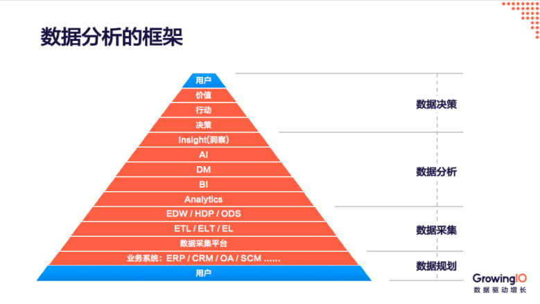

# 1. 数据概述

## 1.1 什么是数据

## 1.2 数据的来源

- 企业内部管理数据
- 企业与用户之间的交互数据
- 外部数据或第三方数据 

## 1.3 数据的类型

### 1.3.1 定性数据&定量数据

#### 定性数据

一般通过问卷调查获取。

- 分类数据：不能区分大小、不能加减、不能乘除。如：男女、天气等
- 顺序数据：可以区分大小。如：满意度评分、幼儿园、小学、中学、大学等

#### 定量数据

一般通过日志获取。

- 数值型数据离散型：可以加减。如：用户数、消费次数等

- 数值型数据连续型：可以乘除。如：成绩、消费金额等

### 1.3.2 连续型数据与非连续型数据

连续型变量：能做频数分析、集中趋势分析（均值、众数、中位数）、离散程度分析（标准差、方差、最大值、最小值、范围）

非连续型变量：主要能做频数分析

### 1.3.3 数据的时间序列类型

过去：历史数据，作用在于总结、对照和提炼知识

现在：当天、当月、当年发生的都可以是现在的数据，用于了解现状，发现问题，及时调整。

未来：指未发生的数据，通过预测得到。用于预测。

## 1.4 数据的价值

# 2. 数据工程概述

# 3. 数据产品架构

# 4. 数据产品全流程

数据采集→数据传输→数据建模/存储→数据统计/分析/挖掘→数据可视化

# 5. 数据分析师的能力要求

- 掌握借助数据发现产品改进关键点的方法
- 掌握利用数据评估产品改版（或新功能）效果的方法
- 学会在数据的配合下快速完成用户画像（persona）的方法
- 知道如何定义数据埋点以及分析需求，并推动研发团队实施
- 学会至少一种产品数据分析工具的使用

- 数据敏感性
- 对于业务的深刻理解
- 逻辑思维能力
- 统计分析能力
- 数据分析工具
- 数据解读能力，直击核心
- 数据应用能力

## 涉及的概念

维度：

维度就是指我们平时看事物的角度，也可理解成分析一个数据能从哪些方面去分析，这些“角度”都是有值且可被枚举的。比如我们注册用户数有10万，那可分析的维度有：用户所在省份、用户性别、用户角色、用户来源等。不同维度来观察数据，可以得出不同结论，能否拓展观察维度，也是评估数据分析能力的一个关键。

度量：

度量和维度相辅相成，是指可量化的数值，用于考察不同维度观察的效果，也可理解成“数据指标”。观察度量值可总体查看，如App总用户数，也可配合“维度”分层查看，如不同省份的注册用户数、不同来源的App启动次数等。

渠道：

指App的不同安装来源，如通过第三方应用市场安装，通过广告点击安装，通过地推二维码扫码安装，通过官网下载安装等。互联网公司的商务工作一般就是拓展渠道，观察不同渠道带来的数据表现，不断优化渠道质量。 

抓包：

指观察App上传到服务器上的数据都有哪些。

一方面可判断自家App是否正确上传了想要统计的数据，另一方面还可抓取到手机上安装的其他App的上传数据，用来分析竞品内容更新情况。

在Mac系统上，用Charles工具，Windows系统用Wireshark。当然抓到的数据如果想进行详尽分析，需要一点基本的http协议知识和json格式知识。

 

 

