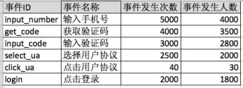
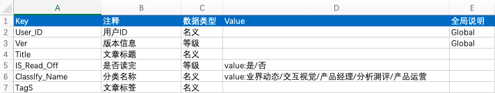
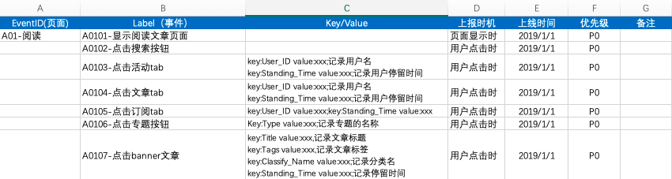
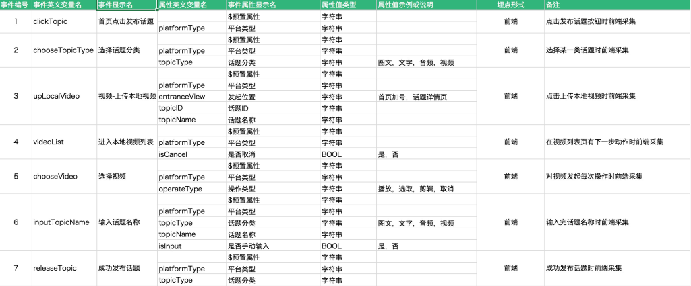

# 1. 什么是埋点

数据埋点是数据收集的手段之一。埋点就是定点的数据采集，然后上报。

代码埋点采集信息的过程一般也称作日志采集。

中小型企业一般采用第三方埋点。即：利用友盟等第三方公司的SDK，通过在App中嵌入一段SDK代码，设定触发条件，当满足条件时，SDK会记录日志，并将日志发送到第三方服务器进行解析，并可视化地呈现给我们。

# 2. 为什么做埋点

- 埋点是很多功能的基础
- 用于分析用户的行为
- 用于构建大数据用户画像，用于AI推荐系统
- 用于分析渠道优劣，对运营做出指导

#  3. 埋点的方式

## 3.1 前端埋点

记录用户在客户端的使用数据，包括但不限于网页，APP，小程序，PC客户端等。

通常说的埋点文档指的是**前端埋点文档**，前端埋点的优势是可以事无巨细的统计到用户的行为数据，劣势是为了性能考虑，并不会实时上报数据，而且数据采集不全面。

适合处于运营初级阶段，产品功能相对简单的公司，适合分析与后端没有交互的前端行为（如判断前端界面设计是否合理）

### 3.1.1 代码埋点

在网站上叫监测代码，在app中叫SDK。

代码埋点最能满足产品的需要。

**说明**：嵌入SDK定义事件并添加事件代码

**场景**：按需采集，业务信息更完善，对数据的分析更聚焦，是一种以业务价值为触发的行为分析，对数据的准确性要求较高

**优点**：按需采集，数据收集全面且准确，便于后续深度分析

**缺点**：需要研发人员配合，增加工作量，可能引起新旧版本兼容性问题

### 3.1.2 可视化埋点

**说明**：嵌入SDK，可视化圈选定义事件

**场景**：直接在页面上进行圈选，以追踪用户的行为（定义事件），仅采集click操作，节省开发时间。适用于用户在页面的行为与业务信息关联较少，页面量较多且页面元素叫较少。如：运营活动、A/B Test、新功能尝试。

**优点**：界面化配置，无需开发，更新埋点时不需要等待程序更新

**缺点**：自定义属性支持范围有限，重构或者页面变化时需要重新配置事件，业务人员工作量大，且缺乏基于业务的解读。

### 3.1.3 无埋点/全埋点

**说明**：通过SDK，自动收集页面所有可点击元素的操作数据。又叫全埋点。

**场景**：无需定义事件，适用于活动页、着陆页、关键页面设计体验衡量。

**优点**：简单、快捷（快速部署、快速评估、快速决策），工作量较少。解决数据的回溯问题

**缺点**：数据上传消耗流量大，数据维度单一（仅点击、加载、刷新）；噪声多，数据准确性不高，容易产生干扰，不能自定义埋点收集信息。

全自动埋点这种“埋点创造于开发过程而不是需求过程”的模式，很容易导致同一个埋点事件，其埋点物理编码在安卓和IOS上是不同的，这就需要埋点需求方花费时间去做对应。对应过程是复杂而艰辛的。

## 3.2 后端埋点

**说明**：通过API的方式，记录程序接口的调用情况，例如接口访问次数，接口返回各个状态次数的统计等。

**场景**：前后端数据整合，如订单数据

**优势**：实时、精准、灵活、无需发版

**劣势**：仅服务端采集，缺少前端的环境信息，前端交互数据缺失

前后端都可以实现数据采集时，应优先考虑后端（代码）埋点，尤其在各行业中有特殊业务需求的数据，更是强烈建议通过后端（代码）埋点方式采集【此说法存疑】

适合追求精细化运营、对数据安全要求高的企业

# 4. 埋点方式的选择

每种埋点方式都有优劣，要根据业务而定。比如：

- 代码埋点+全埋点：用于落地页整体点击分析
- 代码埋点+后端埋点：支付环节需要数据准确性高
- 代码埋点+可视化埋点：核心事件用代码埋点，可视化埋点用于补充

# 5. 数据埋点的部署

私有化部署（即部署在自己公司的服务器上，如果期望提高数据安全性，或者定制化的埋点方案较多，则适合私有部署，并开发一套针对自己公司定制化的数据后台查询系统保证数据的安全性和精确性，缺点是成本较高）。

接入第三方服务，比如国内的友盟和国外的GA（Google Analytics）统计。

# 6. 埋点要记录的数据

## 6.1 访问数据

- 页面访问数（PV、UV）
- 页面访问时长
- 页面流向分布（页面来源）

## 6.2 事件数据（行为）

记录事件的发生次数（可理解为PV）和事件发生人数（可理解为UV）。

**事件ID：**

即EventID，将该事件ID写入需要跟踪的位置中。命名须有规范或第三方id规范命名，如A01_get_code

**事件名称：**

即事件ID的中文名。事件名称命名是在产品上线后，该事件ID有数据后的一个事后行为，通常是在数据平台中定义。

**事件发生次数：**

在每个事件中，都会有个事件ID计数器，每当该事件被触发时，事件数即加1；

**事件发生人数：**

每当该事件被触发时，同时记录下该用户的唯一标识，根据用户唯一标识，对事件发生次数进行去重。

事件统计的结果通常为：

# 7. 埋点文档

产品经理需要把各方需求整理成数据需求，然后根据数据需求写埋点文档。

埋点文档相当于产品的账本，记录产品的各项情况。

数据字典是用来定义自定义事件属性的文档，埋点文档需要用到数据字典。如下：

**KEY：**
属性的名称。key的命名有驼峰和下划线命名法。
**注释：**
对于key字段的解释
**数据类型：**
数据类型分为名义数据、等级数据和连续数据三种
**Value：**
Value是Key对应的值，有一些Key对应的是不确定的值，例如User_ID，有多少个用户就有多少个值，所以Value可以为空。但有一些Key的Value是限制在一定范围内的，所以需要事先对Value的可选择值作出定义，例如如果想统计一篇文章是否读完，可以定义一个Is_Read_Off的Key，那么对应的value值只有两个，是或否。
**全局字段Global：**
有一些key值是需要所有的事件都要进行统计的，此时全局字段填写global。

在埋点文档中，基于数据字典，给自定义事件添加属性：

**EventID：**
定义页面的ID号和名字，可以通过英文字母区分不同的业务模块，数字区分不同的页面。这里的EventID代表的是页面，其实也可以代表事件，但不推荐。
Label:
定义的是用户在这个页面上的使用行为，因为Label是从属于前面EventID的，所以在功能点编号上也要继承前面的编号。
如果某个点击事件是进入到了EventID的子页面，那么这个事件Label的编号就自动变为这个EventID的编号，这样可以很好的体现上级页面与下级页面的从属关系。
但如果一个页面可以由多个Label事件进入，那么就不用这么处理，而是直接使用一个公共的编号就可以。
**上报时机：**
说明这个埋点事件根据什么条件来触发，通常来讲分为显示时触发和操作时触发两种，前者看的是曝光量，后者看的是转化量。
**上线时间：**
说明该埋点是什么时候上线的，一般使用上线时间来作为埋点的生效时间。
**优先级：**
同需求优先级，因为埋点需求也是需求啊。

 

 

## 7.1 埋点文档的注意事项

1、埋点文档只可增加，不可修改和删除。在备注中标明，该埋点已于xx时间废弃即可。

2、事件必须独立

- 通用的页面事件需保持唯一的编号
  - 如果有一个通用的页面可以通过不同的入口进入，那么可以在这个页面的时间中添加from_page的属性，来记录是从哪个入口进入的

- 不同页面的相同事件保持独立
  - 使用eventID+label可以解决唯一编号

3、数据字典不重复

数据字典中每一个key都是唯一的

4、注意平台限制

不同的埋点平台可能对于事件和属性有上限的限制

5、埋点数据上报率不一定是100%，需要考虑服务器负荷及性能的影响

6、埋点测试

与测试人员协作进行埋点成功与否的测试

7、如果产品分布的平台较多，互相之间差异较大，最好分不同平台来撰写不同的埋点文档。

8、一开始不要设置太多的埋点事件，要循序渐进。

 

 

 

如何确定哪些该埋哪些不该埋？

《首席增长官》P54 

数据上报

