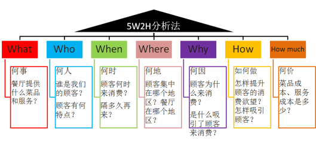

数据分析方法论：从宏观角度指导如何进行数据分析。

数据分析法：具体的分析方法。

数据分析应该先明确分析目的，再建立分析方法和思路；以业务场景为起始思考点，以业务决策作为终点。

# 1. 常用的数据分析思路

**从趋势观察数据；从对比中发现问题；多维度细分找出问题原因。**

**任何分析问题的核心，就是通过任意维度不断细分下钻。**

**我们应该只花20%的时间看数据，80%的时间分析数据。**

## 1.1 对比

根据对比方法不同，分为“横向对比”和“纵向对比”。

横向对比：指空间维度的对比。相当于一个指标，在不同条件下的对比，但每个条件都属于一个层级。举个例子，App功能的A/B测试数据对比，各个渠道的新增用户对比，都属于横向对比。

纵向对比：指时间维度的对比。一般的对比方法有：同比、环比。同比一般指是指本期数据与上年同期数据对比，环比则是本期统计数据与上期比较。观察时间轴上的数据折线图来判断产品运营状态也是一种纵向对比。

## 1.2 分组

也可叫聚类，合适的分组能更好地理解业务和场景。例如用户画像过程，就是一个按不同维度对数据分组的过程。通过用户画像，可以很清晰地知道产品的用户地区、用户兴趣、用户年龄、用户性别等属性占比，产品经理可通过画像进一步了解用户需求。

## 1.3 拆分

就是“拆分”和“解析”，当某个维度对比后发现问题需要找原因时，就需要进一步“拆分”了。举个例子，如果发现某日的销售额只有昨日的50%，就需要对销售额指标拆分为：成交用户数 x 客单价，而成交用户数 = 访客数 x 转化率。那么我们接下来就可分别针对：访客数、转化率、客单价，观察今日和昨日相比的数据变化，找出原因。

## 1.4 降维

当维度太多时，我们不可能全部分析，这时就要筛选出有代表性的关键维度，去除掉那些无关数据，这就是“降维”。比如“成交用户数 = 访客数 x 转化率”，当同时存在这三个指标时，其实我们只要三选二就能得出结论了。

## 1.5 增维

增维和降维是相对的，如果当前观察的维度无法解释当前问题，就需要对数据进行运算，多增加一个指标。在可视化分析领域，也可将不同类型的图表嵌套使用，能达到增加信息展现维度，扩展分析广度的目的，如下图所示：（将环形图和折线图进行增维嵌套）。

## 1.6 假说

当我们不知道结果，或者有几种选择时，我们可以先假设有了结果，然后运用逆向思维。当然，除了结果可以假设，过程也可以假设。

# 2. 常用的数据分析模型

## 2.1 AARRR模型

## 2.2 RFM模型

R：Recency，最近一次购买时间

F：Frequency，购买频次

M：Money，购买金额

## 2.3 人货场模型

人：用户数、留存率

货：商品数量、商品动销率、商品单价、客单件

场：网站、渠道、点位数、展示位置

## 2.4 用户行为理论

用户使用行为理论分析法——用于用户的行为研究分析（目前常用于网站、智能手机、应用程序等用户的**行为研究**分析）。

认知、熟悉、试用、使用、忠诚。

以网站分析为例：
认知——网站访问——IP、PV、人均页面访问量、访问来源
熟悉——网站浏览——平均停留时长、跳出率、页面偏好
熟悉——站内搜索——搜索访问次数占比
试用——用户注册——注册用户数、注册转化率
使用——用户登录——登录用户数、人均登录、访问登录比
使用——用户订购——订购量、订购频次、内容、转化率
忠诚——用户黏性——回访者比率、访问深度
忠诚——用户流失——用户流失数、流失率

## 2.5 PEST分析法-行业分析

PEST分析法——用于分析宏观环境（针对影响行业和企业的主要外部环境因素进行分析）。

Political、Economic、Technological、Social

## 2.6 5W2H分析法

5W2H分析法——“万金油”一样的分析理论（广泛应用于企业营销、管理活动分析）。

Why何因 What何事 Who何人 When何时 Where何地 How如何做 How much何价

## 2.7 4P营销理论-企业整体经营状况分析

4P营销理论分析法——用于公司业务分析（有助于全面了解公司的整体运营情况）

Product（产品） Price（价格） Place（渠道）Promotion（促销）

## 2.8 逻辑树分析法-业务问题专题分析

逻辑树分析法——有助于理清思路（将子问题分层罗列，使问题要素化、框架化、关联化，使思考不重不漏）。

分层罗列影响因素，发现问题。已知问题作为树干，相关问题作为树枝，将问题的所有子问题分层罗列。

遵循以下三个原则：

- 要素化：把相同问题总结归纳成要素。
- 框架化：将各个要素组织成框架，遵守不重不漏的原则。
- 关联化：框架内的各要素保持必要的相互关系，简单而不孤立。

## 2.9 矩阵关联分析法

对2-4个重要属性进行分析。

矩阵（2个指标）
发展矩阵（2个指标，可预测下一阶段产品发展情况）
改进难易矩阵（3个指标，形成气泡图，用于产品线产品决策）

## 2.10 [构建Build-衡量Measure-学习Learn]模型

## 2.11 内外因素分解模型

内/外部因素+可控与否

**要学会根据自己的业务来建立自己的数据分析模型。**

# 3. 经典的数据分析方法

## 3.1 对比分析法

对比分析法，是指将两个或两个以上的数据进行比较，分析它们的差异，从而揭示这些数据所代表的事物发展变化情况和规律性。

它的特点是：可以非常直观地看出事物某方面的变化和差距，并且可以准确、量化地表示出这种变化和差距是多少。
    1）实际完成与目标的对比。
    2）两个不同时期的对比。
    3）同级部门、单位、地区的对比。
    4）行业内对比（竞争对手对比）
    5）活动效果对比。

- 静态比较（横向比较，横比）
  - 同一时间不同总体指标
- 动态比较（纵向比较，纵比）
  - 同一总体不同时期指标

## 3.2 分组分析法

分组分析法，是根据数据分析对象的特征，按照一定的标志和区别，把数据分析对象划分为不同的部分和类别来进行研究，以提示其内在的联系和规律性。

- 等距分组
  - 组距=（最大值-最小值）/组数
- 不等距分组

## 3.3 漏斗图分析法

漏斗图是一个适合业务流程比较规范、周期比较长、各流程环节涉及比较复杂、业务过程比较多的管理分析工具。

## 3.4 交叉分析法

交叉分析法，通常用于分析两个变量（字段）之间的关系，即同时将两个有一定联系的变量及其值交叉排列在一张表格内，使各个变量值成为不同变量的交叉结点，形成交叉表，从而分析交叉表中变量之间的关系。

## 3.5 结构分析法

结构分析法，是指被分析研究总体内各部分与总体之间进行对比的分析方法，即总体内各部分占总体的比例。

结构相对指标（比例）=（总体某部分的数值/总体总量）×100%

例：市场占有率=（某种商品销售量/该种商品市场销售总量）×100%

## 3.6 杜邦分析法（指标拆解法）

## 3.7 综合评价分析法

## 3.8 因素分析法

# 4. 高级分析法

相关分析法

回归分析法

聚类分析法

判别分析法

主成分分析法

因子分析法

对应分析法

时间序列分析法

 

# 5. 数据分析的原则

- 不过浅层次解读数据，容易停留表象 
- 基于业务逻辑和用户场景理解数据预期 
- 善用控制变量，善用对比分析法 
- 善用数据平滑，避免更细粒度波动干扰 
- 相信数据不会说谎，被误导是因为解读视角问题

单天波动忽高忽低，去掉极端数据后，求周平均值

 

数据分析三字经：

学习：先了解，后深入；先记录，后记忆；先理论，后实践；先模仿，后创新。
方法：先思路，后方法；先框架，后细化；先方法，后工具；先思考，后动手。
分析：先业务，后数据；先假设，后验证；先总体，后局部；先总结，后建议。

