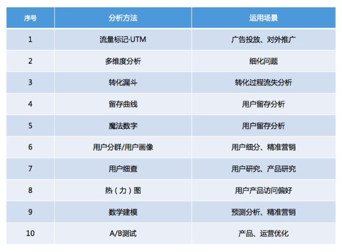

数据分析的方法

# 数据统计

# 链接标记Link Tag

# 渠道归因Atrribution

# 趋势分析

# 多维分解

# 事件分析

# 漏斗分析Funnel

# 用户分群Segmentation

# 用户分层

# 用户行为统计

# 用户行为路径

# 用户细查insight

# 热力图分析Heat Map

# 同期群分析Cohort

# 留存分析Retention

# 粘性分析

# A/B测试

# 魔法数字

# 数据下钻

# 用户画像

# 用户群建模

