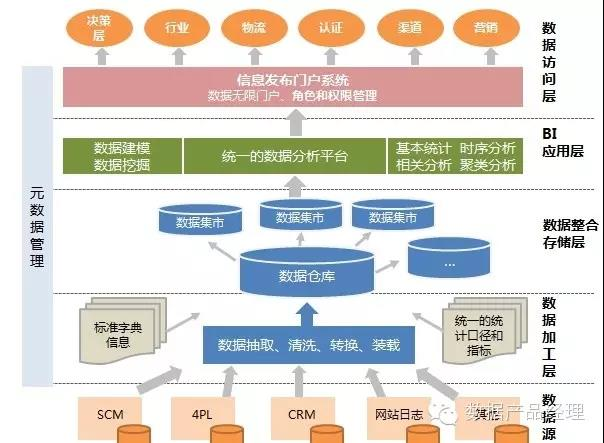
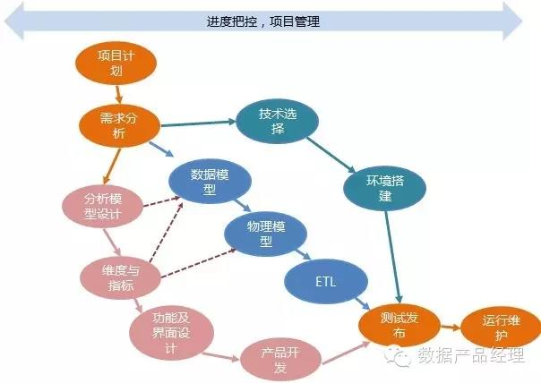
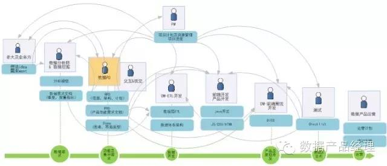
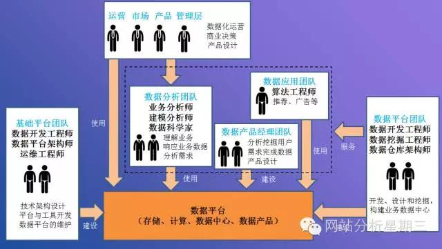

### 数据产品输出形式

- 数据前台利用（展示和算法）
  - 如排序、搜索、个性化推荐
- 数据后台利用（表格、可视化、警报等）
  - 从最初的excel、到报表系统、到可视化系统，不断优化呈现方式，提升解读效率。
- 数据外部引用和对外输出
  - 引用第三方数据工具，如用户画像等
  - 开放平台或API：需要考虑数据安全性，数据美化，应用监控，战略决策等多方面的问题。
  - 数据对账：与合作方对数据，防止对方作弊。

### 数据PM工作职责

- 数据分析及解答
  - 在同事眼里你就是能够解答任何数据问题的，这个时候数据分析能力和沟通能力都很重要。

- 业务与战略沟通

- 数据字段设计及记录
  - 从点击记录到业务日志，从最底层的数据字段到中间表到输出给最终用户看到的内容。通通都要理解、熟悉和可以设计。
  - 数据产品经理是做数据产品不是做框架建设的，必须熟悉数据来源。

- 数据产品结构搭建及管理

- 数据挖掘、数据建模、机器学习
  - 统计学、算法、建模知识等

### 数据PM能力要求

- 要极其熟悉公司业务及动向

- 要了解数据分析。好的数据PD，即使不做数据PD，也应该是个数据分析师。

- 要了解数据仓库及商务智能

- 要精通数据产品开发流程。数据开发+产品开发

  - **数据源——是否足够，是否稳定**——数据PD需要足够了解目前的业务处理系统建设情况，以及数据源的积累程度，用以判断数据产品的建设时间是否合适。
  - 数据产品是用以支持监控，分析，决策的，而业务处理系统的定位在于提升工作效率，解放工作人员手脚。业务系统采集的数据未必满足所有分析需要。
  - **分析模型的设计—— 分析模型的好与不好，其实决定了数据产品的成败**。
    - 分析模型应该会包含几点：
      - 主题的划分：整块分析会划分成什么主题，比如销售可能会分成销售走势及构成分析，行业排名，商品排名等
      - 度量及指标：分析主题会涉及到的度量及指标的算法、定义等（这通常会产生一份指标以及维度的定义及描述文档）
      - 维度：要分别从什么维度去看这些指标和度量，如时间，渠道，这些维度是要筛选还是要对比
      - 钻取：这些维度本身有没有层次，需要不需要进行钻取，如渠道可钻取到渠道类型，行业可钻取到子行业，商品类目可钻取到商品叶子类目等
      - 输出：分析需要用何种图表进行展现
  - **数据的ETL开发—**—数据的清洗，转换，装载流程占用了数据产品开发的大半资源，不规范的数据源会导致这一块的资源更大程度的占用。
  - **前端交互与体验的优化**
  - **环境，技术，工具**。需要了解公司的部署环境、所选型的工具

数据PM的工作职责：
 

解读一：

1、为公司的基础工作服务。比如该有的数据仓库、数据存储、数据清洗、各条业务线常规的数据报表等等，通过产品的方式服务于公司各条线。

2、大数据应用。基于大数据的应用型产品。

3、开放服务。建立开放服务机制和产品，协同其他产品通过大数据为公司服务。

4、通过数据洞察，对洞察结果产品化，提升业务方运营效率。

5、数据可视化。从最初的excel、到报表系统、到可视化系统，不断优化呈现方式，提升解读效率。

6、挖掘数据背后的价值并且将其沉淀为通用化的东西，即数据产品。

岗位职责:
1、负责中后台项目的数据整合，并以产品化方式进行需求梳理，原型设计，上线和快速迭代;
2、负责在项目推进过程中的协调沟通工作，能够协调各资源以确保产品顺利发展;
3、关注数据应用相关方向的前沿研究，并将相关数据结合产品特点，设计数据个性化产品及可视化产品，或进行数据价值输出，支持各类用户对大数据的洞察，主导数据产品的商业化推进;
4、负责建立公司中后台相关项目的评估模型，并通过数据结果优化内部相关产品运营/项目推进。

岗位要求:
1、3年及以上数据分析/产品策划相关经验，有会员/营销经验优先，侧重数据挖掘、数据系统、数据产品;
2、本科及以上学历，理工科背景佳，计算机,数学，统计相关专业优先考虑;
3、有零售行业相关经验优先，理解数据产品的商业模式和产业生态，能全面考虑产品形态和推进节奏; 
4、熟练掌握界面原型和交互设计,有平台型产品的设计经验;
5、用户导向，具有较强的产品运营思路。

**数据产品经理工作职责：**

1.分析业务部门实际需求，规划、推进公司数据平台的建设及维护；--**数据平台建设**

2.全方面分析客户端数据，对产品改进提供数据支持；--**客户端数据分析**

3.通过数据挖掘和统计报表，提升业务部门运营数据的透明度，提升运营效率；--**数据统计协助，数据化运营**

4.熟练运用各种内外部数据统计工具，快速响应各个部门的数据需求；--**协助其他部门**

5.整理、提炼已有的数据报告，发现数据变化，进行深度专题分析，形成结论，撰写报告；--数据分析报告 6.负责公司数据产品的设计及开发实施，并保证业务目标的实现；深入研究运营商数据，结合现有公司广告平台、商业平台、智慧平台的业务需求并进行产品设计；与业务部门进行业务需求沟通，并整理出相应的需求和流程文档，确定开发目标 —**数据产品开发**

**数据产品经理职位要求：**

**一、工作经验要求：**

1.1年以上移动互联网产品工作经验；

2.熟悉数据仓库技术，有BI和数据挖掘背景者优先；

3.有数据分析/数据挖掘/用户行为研究的项目实践经验

**二、知识技能要求：**

1.有扎实的分析理论基础，精通1种以上统计分析工具软件，如SPSS、SAS，熟练使用Excel、SQL等工具

2.熟悉SQL/HQL语句，工作经历有SQL server/My SQl等的优先

3.熟练操作excel，ppt等办公软件,熟练使用SPSS、SAS等统计分析软件其中之一

4.熟悉hadoop集群架构、有BI实践经验、参与过流式计算相关经验者加分

5.熟悉客户端产品的产品设计、开发流程

6.对手机游戏市场、渠道推广较为熟悉

7.精通Axure RP等产品设计工具

 

预警机制：
需要有短信接口、邮件接口等 

 

1. 数据产品的价值
2. 数据产品的用户
3. 数据产品架构

4. 数据产品风险
5. 数据产品VS业务系统
6. 数据产品项目流程

7. 数据产品交付物

## 组建大数据团队

数据团队有哪些成员组成？他们的工作方式是什么？采用怎样的组织架构来开展工作？

### 1、数据团队成员

这里只讨论数据团队中核心成员的角色和他们的工作职责。

**1）基础平台团队**

主要负责搭建稳定、可靠的大数据存储和计算平台。

核心成员包括：

> **数据开发工程师**
>
> 负责Hadoop、Spark、Hbase和Storm等系统的搭建、调优、维护和升级等工作，保证平台的稳定。
>
> **数据平台架构师**
>
> 负责大数据底层平台整体架构设计、技术路线规划等工作，确保系统能支持业务不断发展过程中对数据存储和计算的高要求。
>
> **运维工程师**
>
> 负责大数据平台的日常运维工作

**2）数据平台团队**

主要负责数据的清洗、加工、分类和管理等工作，构建企业的数据中心，为上层数据应用提供可靠的数据。

> **数据开发工程师**
>
> 负责数据清洗、加工、分类等开发工作，并能响应数据分析师对数据提取的需求。
>
> **数据挖掘工程师**
>
> 负责从数据中挖掘出有价值的数据，把这些数据录入到数据中心，为各类应用提供高质量、有深度的数据。
>
> **数据仓库架构师**
>
> 负责数据仓库整体架构设计和数据业务规划工作。

**3）数据分析团队**

主要负责为改善产品体验设计和商业决策提供数据支持。

> **业务分析师**
>
> 主要负责深入业务线，制定业务指标，反馈业务问题，为业务发展提供决策支持。
>
> **建模分析师**
>
> 主要负责数据建模，基于业务规律和数据探索构建数据模型，提升数据利用效率和价值。

### 2、数据团队的工作方式

数据团队的工作可以分成两大部分，一部分是建设数据存储和计算平台，另一部分是基于数据平台提供数据产品和数据服务。

**平台的建设者包括三种人群**：基础平台团队对hadoop、spark、storm等各类大数据技术都非常熟悉，负责搭建稳定、可靠的大数据存储和计算平台。数据平台团队主要负责各类业务数据进行清洗、加工、分类以及挖掘分析，然后把数据有组织地存储到数据平台当中，形成公司的数据中心，需要团队具有强大的数据建模和数据管理能力。数据产品经理团队主要是分析挖掘用户需求，构建数据产品为开发者、分析师和业务人员提供数据可视化展示。

**平台的使用者也可以包括三种人群**：数据分析团队通过分析挖掘数据，为改善产品体验设计和商业决策提供数据支持。运营、市场和管理层可以通过数据分析师获得有建设性的分析报告或结论，也可以直接访问数据产品获得他们感兴趣的数据，方便利用数据做决策。数据应用团队利用数据平台团队提供的数据开展推荐、个性化广告等工作。

 

### 3、数据分析团队的组织架构

在整个大数据平台体系中的团队：基础平台、数据平台、数据应用和数据产品经理团队都可以保持独立的运作，只有数据分析团队的组织架构争议比较大。数据分析团队一方面要对业务比较敏感，另一方面又需要与数据平台技术团队有深度融合，以便能获得他们感兴趣的数据以及在数据平台上尝试实验复杂建模的可能。

从他们的工作方式可以看出，数据分析团队是衔接技术和业务的中间团队，这样的团队组织架构比较灵活多变：

**1）外包**

公司自身不设立数据分析部门，将数据分析业务外包给第三方公司，当前电信行业，金融行业中很多数据分析类业务都是交给外包公司完成的。

> **优势：** 很多情况下，可以降低公司的资金成本和时间成本；许多公司内部缺乏相关的知识与管理经验，外包给专业的团队有助于公司数据价值的体现 。
>
> **劣势：**一方面外包人员的流动和合作变数，对数据的保密性没有保证；另外一方面，外包团队对需求的响应会比较慢，处理的问题相对通用传统，对公司业务认知不如内部员工深入，创新较低。

**2）分散式**

每个产品部门独立成立数据分析团队，负责响应自己产品的数据需求，为业务发展提供决策支持。

> **优势：**数据分析团队与开发团队、设计团队以及策划团队具有共同的目标，团队整体归属感强，绩效考核与产品发展直接挂钩，有利于业务的发展。
>
> **劣势：**在业务规模比较小的情况下，数据分析师比较少，交流的空间也比较小。因为身边的同事都不是该领域的人才，无法进行学习交流，所以成长空间会比较小，分析师的流失也会比较严重，最终陷入招募新人——成长受限——离职——招募新人的恶性循环。另一方面，每个产品团队都零星地招募几个分析师，整体来看给员工的感觉是公司并不是特别重视数据化运营的文化，对数据的认同感会被削弱，不利于公司建立数据分析平台体系。

**3）集中式**

数据分析团队与产品团队、运营团队各自独立，团队的负责人具有直接向分管数据的副总裁或CEO直接汇报的权限，团队负责响应各业务部门的数据需求。

> **优势：**分析团队具有充分的自主权，可以专心建设好公司级别的数据平台体系，研究数据最具有价值的那些问题，有权平衡业务短期需求和平台长期需求直接的关系。另一方面，这种自上而下建立起来组织架构，可以向全体员工传达数据在公司的重要位置，有利于建立数据化运营的文化。
>
> **劣势：**产品业务团队会觉得他们对数据的掌控权比较弱，一些业务数据需求得不到快速响应，认为分析团队的反应太慢无法满足业务发展的需要。随着业务发展越来越大，产品团队会自己招募分析师来响应数据需求，逐渐替代分析团队的工作，这样势必会导致分析团队的工作被边缘化。

**4）嵌入式**

数据分析团队同样独立于产品团队存在，但只保留部分资深数据专家，负责招聘、培训数据分析师，然后把这些人派遣到各产品团队内部，来响应各类业务数据需求。

> **优势：**团队的灵活性比较好，可以根据公司各业务线的发展情况合理调配人力资源，重点发展的项目投入优秀的人才，一些需要关闭的项目人才可以转移到其他项目中去。
>
> **劣势：**分析师被嵌入到产品团队内部，受产品团队主管的领导，从而失去了自主权，导致沦落为二等公民。人事关系在公司数据分析团队中，却要被业务团队主管考核，但业务团队主管并不关心他们的职业发展，导致分析师的职业发展受到限制。

**那么，到底采取哪一种组织架构比较合适呢？**

可以根据公司数据化运营进展的深度灵活采取一种或几种方式。除了外包模式，其他组织架构我都经历过，简单来说，早期采用分散式、中期采用集中式、后期采用分散式或嵌入式以及两则并存。

**早期：**公司对数据体系的投入一般是比较谨慎的，因为要全面建设数据体系需要投入大量的人力和财力，公司不太可能还没有看清楚局势的情况下投入那么多资源。所以，往往都是让每个产品团队自己配置分析师，能解决日常的业务问题就行。杭研院早期的网易云阅读、印像派等项目中就是采用的这种分散的模式。

**中期：**随着业务的发展、公司对数据的认识有所提高并且重视程度不断加大，就开始愿意投入资源来构建公司级别的数据体系。这个阶段采用集中式有利于快速构建数据分析平台，为公司各个产品团队提供最基础的数据分析体系，能在未来应对业务的快速发展。杭研院花了两年时间完成了这个阶段的主要工作，并在网易云音乐和易信产品发展阶段起到了至关重要的作用。

**后期：**一旦公司级别的数据分析平台构建完成，消除了早期分散模式中分析师缺少底层平台支持的窘境，他们能够在分析平台上自助完成大量的数据分析工作。而且经历过集中式阶段的洗礼，公司上上下下对数据的认识都有了很大的提高。此时，在回到分散模式时，原先的很多弊端已基本消除，此外，采用嵌入模式也是可以的。目前杭研院在网易云音乐、网易云课堂、考拉海购等几个产品中就是分散式和嵌入式并存的架构。

总之，没有最好的组织架构，只有适合自己的组织架构。

**埋点数据该如何存储，该如何统计，业务数据该如何存储，如何统计。BI商务智能产品该怎么做，数据立方体该是如何，经营分析系统该如何分析，流量分析系统该怎么做，网站分析该如何分析，等····**

